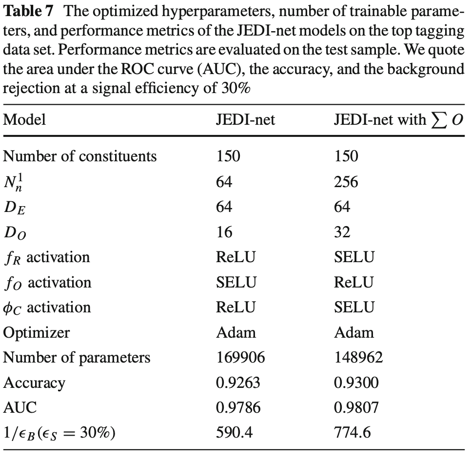

# JEDInet-code

[](https://doi.org/10.5281/zenodo.3986966)

Code for E. Moreno et al., JEDI-net: A jet identification algorithm based on interaction networks, Eur. Phys. J. C 80, 58 (2020), [doi:10.1140/epjc/s10052-020-7608-4](https//doi.org/10.1140/epjc/s10052-020-7608-4), [arXiv:1908.05318](https://arxiv.org/abs/1908.05318).
To cite, use:
```
@article{Moreno:2019bmu,
    author = "Moreno, Eric A. and Cerri, Olmo and Duarte, Javier M. and Newman, Harvey B. and Nguyen, Thong Q. and Periwal, Avikar and Pierini, Maurizio and Serikova, Aidana and Spiropulu, Maria and Vlimant, Jean-Roch",
    title = "{JEDI-net: a jet identification algorithm based on interaction networks}",
    eprint = "1908.05318",
    archivePrefix = "arXiv",
    primaryClass = "hep-ex",
    reportNumber = "FERMILAB-PUB-19-360-PPD",
    doi = "10.1140/epjc/s10052-020-7608-4",
    journal = "Eur. Phys. J. C",
    volume = "80",
    pages = "58",
    year = "2020"
}
```
and 
```
@software{javier_duarte_2020_3986967,
  author       = {Javier Duarte and
                  Jean-Roch Vlimant and
                  Maurizio Pierini and
                  Olmo Cerri},
  title        = {jmduarte/JEDInet-code: v1.0.0},
  month        = 8,
  year         = 2020,
  publisher    = {Zenodo},
  version      = {v1.0.0},
  doi          = {10.5281/zenodo.3986966},
  url          = {https://doi.org/10.5281/zenodo.3986966}
}
```

To test the IN architecture on the [public top tagging dataset](https://zenodo.org/record/2603256), follow these steps.

## Download data
Download the preprocessed files from CERNBox:
https://cernbox.cern.ch/index.php/s/I2AVonDyOdgr1bj

(Warning: 14 GB zipped tar ball)

There are 122 training files, 41 validation files, and 41 testing files. Each file has ~10k jets. The files contain the 224x224 jet images (img_pt) and up to 100 particle constituents with various properties (see below), and labels (first index is top, second index is QCD). Note the top vs QCD jets come in chunks so some shuffling is good.

## Setup libraries
Setup necessary libraries like PyTorch. One option is to use a singularity image generated from this: https://github.com/cmscaltech/gpuservers/blob/master/singularity/cutting_edge.singularity

## Training
 Example commands for training
 ```
SINGULARITY_IMAGE=/storage/group/gpu/software/singularity/ibanks/edge.simg
# train without sumO 
singularity exec --nv -B /storage -B /bigdata $SINGULARITY_IMAGE python3 JetImageClassifier_INTop_FinalTraining.py 150 1 0
# train with sumO
singularity exec --nv -B /storage -B /bigdata $SINGULARITY_IMAGE python3 JetImageClassifier_INTop_FinalTraining.py 150 1 1
```

## Testing
Example commmands for testing
```
# test without sumO
singularity exec --nv -B /storage -B /bigdata $SINGULARITY_IMAGE python3 JetImageClassifier_INTop_Test.py 150 1 0
# test with sumO
singularity exec --nv -B /storage -B /bigdata $SINGULARITY_IMAGE python3 JetImageClassifier_INTop_Test.py 150 1 1
```
## Results

Results should be similar to Table 7 in the paper:


